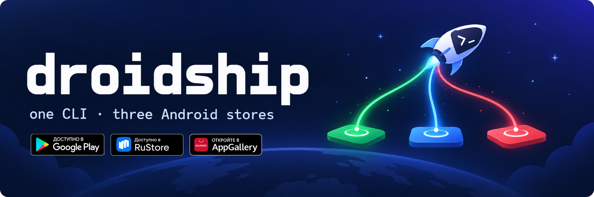

<p align="center"></p>

# droidship

**Один CLI для Android-релизов в Google Play, RuStore и Huawei AppGallery.** Залить сборку, поставить
её в очередь, раскатить, ответить на отзывы — одинаковыми командами для всех сторов, из терминала или
через AI-агента.

[](https://github.com/kirvigen/droidship/actions/workflows/ci.yml)
[](https://github.com/kirvigen/droidship/releases)
[](go.mod)
[](LICENSE)

[Read in English](README.md)

```console
$ droidship status com.example
STORE       TRACK       VERSION      STATUS                 ROLLOUT  ID
gplay       production  30           completed
rustore     manual      1.4.16 (29)  MODERATION                      2051234567
appgallery  latest      1.4.16 (29)  pending update review           1998765432101234567
appgallery  live        1.4.11 (23)  on shelf
```

- **Одна команда вместо трёх консолей.** `publish`, `release`, `rollout`, `reviews` и `reply` работают
  одинаково во всех сторах. `--store all` запускает их везде сразу.
- **Безопасно по умолчанию.** `publish` заливает сборку и ставит её в очередь. Пользователи её не
  увидят, пока не выполнить `release`.
- **Ничего не потеряно.** Всё, что умеет только один стор, осталось под его именем: ачивки Play Games,
  скриншоты, черновики RuStore, окна поэтапной выкатки AppGallery.
- **Сделан для агентов.** У каждой команды есть `--json`, коды выхода — часть контракта, скиллы для
  Claude Code лежат в репозитории.
- **Один статический бинарник.** Только стандартная библиотека Go, без зависимостей.

## Установка

```bash
go install github.com/kirvigen/droidship/cmd/droidship@latest
```

Или скачать бинарник для macOS, Linux или Windows из
[Releases](https://github.com/kirvigen/droidship/releases).

## Быстрый старт

```bash
droidship auth                                    # какие сторы подключены и под кем
droidship status com.example                      # что где опубликовано
droidship publish com.example --store all \
  --aab app-release.aab --notes-file whatsnew.txt # залить и поставить в очередь везде
droidship release com.example --store gplay --percent 10
droidship reviews com.example --unanswered        # все сторы, новые сверху
```

## Что умеет каждый стор

| Команда | Google Play | RuStore | AppGallery |
|---|:-:|:-:|:-:|
| `auth` | ✓ | ✓ | ✓ |
| `status` | ✓ | ✓ | ✓ |
| `publish` | ✓ только AAB | ✓ APK / AAB | ✓ APK / AAB |
| `release` | ✓ | ✓ | ✓ |
| `rollout` | ✓ | ✓ шагами 5–100 % | ✓ |
| `notes` | ✓ | — ¹ | ✓ |
| `reviews` | ✓ за 7 дней ² | ✓ | ✓ |
| `reply` | ✓ до 350 знаков | ✓ до 500 знаков | ✓ |
| `listing` | ✓ | — ³ | ✓ |

¹ RuStore принимает «Что нового» только вместе с новой версией: `publish --notes`.
² API Google Play отдаёт отзывы только за последнюю неделю.
³ В API RuStore нет чтения страницы приложения.

Неподдерживаемая команда завершается с кодом **3** и объяснением в одну строку. Остальные сторы
при этом отрабатывают.

## Доступы

Каждый стор ищет доступы в таком порядке, побеждает первое найденное:

1. флаг (`--key` для Google Play; `--app-id`, `--region` в командах AppGallery);
2. переменные окружения `DROIDSHIP_*`;
3. переменные, которые читали отдельные утилиты (`GPLAY_SA_JSON`, `RUSTORE_KEY_ID`, `HSTORE_*`, …);
4. `~/.config/droidship/config.json` или файл из `$DROIDSHIP_CONFIG`;
5. файлы отдельных утилит (`~/.config/gplay/*.json`, `~/.config/hstore/credentials.json`).

Машина, настроенная под gplay, rstore или hstore, работает без изменений. `droidship auth` показывает,
откуда взят доступ каждого стора. Сами значения он не выводит.

```json
{
  "gplay":      { "key": "~/.config/droidship/play-service-account.json" },
  "rustore":    { "key_id": "123", "private_key": "MIIEvQIBADAN…" },
  "appgallery": { "client_id": "…", "client_secret": "…", "region": "global" }
}
```

Файл держать закрытым: `chmod 600 ~/.config/droidship/config.json`.

### Google Play

droidship входит как **сервисный аккаунт Google Cloud**. Нужны два условия:

1. **Ключ существует.** Сервисный аккаунт в Cloud-проекте с включённым Google Play Android Developer API:

   ```bash
   gcloud services enable androidpublisher.googleapis.com --project=PROJECT
   gcloud iam service-accounts create droidship --project=PROJECT
   gcloud iam service-accounts keys create ~/.config/droidship/play-service-account.json \
     --iam-account=droidship@PROJECT.iam.gserviceaccount.com
   ```

   IAM-ролей в Cloud-проекте аккаунту не нужно.
2. **У ключа есть доступ к приложению.** Play Console → *Пользователи и разрешения* → *Пригласить
   пользователей* → email сервисного аккаунта → приложение → права на релизы. Доступ появляется через
   несколько минут.

`droidship auth` проверяет первое условие. Второе подтверждает только
`droidship status <package> --store gplay`. Переменная: `DROIDSHIP_GPLAY_KEY` (путь к JSON-ключу).

### RuStore

RuStore Консоль → *Компания* (или *Разработчик*) → *API RuStore* → *Создать ключ*. Выбрать приложения
и как минимум группу методов «Загрузка и публикация приложений». droidship подписывает метку времени
приватным ключом (SHA512withRSA) и меняет подпись на короткоживущий токен. Ключ не покидает машину.

Переменные: `DROIDSHIP_RUSTORE_KEY_ID`, `DROIDSHIP_RUSTORE_PRIVATE_KEY` (base64 одной строкой, как
выдала консоль).

### Huawei AppGallery

AppGallery Connect → *Пользователи и разрешения* → *Ключ API* → *Connect API* → *Создать*. Для релизов
нужна роль *Администратор приложения*, для ответов на отзывы — *Служба поддержки*. **Проект — N/A**:
клиент, привязанный к проекту, получает 403. Id и секрет показываются один раз.

Переменные: `DROIDSHIP_APPGALLERY_CLIENT_ID`, `DROIDSHIP_APPGALLERY_CLIENT_SECRET`, по желанию
`DROIDSHIP_APPGALLERY_APP_ID`, `…_PACKAGE`, `…_REGION` (`global`, `ru`, `eu`, `sg`). Аккаунт живёт в
одном дата-центре, найти его помогает `droidship appgallery auth --probe`. JSON с
`key_id`/`private_key`, который консоль предлагает скачать, относится к другой схеме. Если указать на
него, droidship об этом скажет.

## Общие команды

```text
droidship auth    [--store S]                          какие сторы подключены и под кем
droidship status  <pkg> [--store S]                    версии, треки, статус проверки
droidship publish <pkg> --store S (--aab F | --apk F)  залить и поставить в очередь
                  [--notes S | --notes-file F] [--lang ru-RU] [--percent P] [--go-live]
droidship release <pkg> --store S [--version V] [--percent P]
droidship rollout <pkg> --store S --percent P [--version V]
droidship notes   <pkg> --store S [--lang ru-RU] (--text S | --text-file F)
droidship reviews <pkg> [--store S] [--stars N] [--unanswered] [--days 7] [--limit 50]
droidship reply   <pkg> <reviewId> --store S (--text S | --text-file F)
droidship listing <pkg> [--store S] [--lang ru-RU]
```

`--store` — это `gplay`, `rustore`, `appgallery`, список через запятую или `all`. Команды чтения по
умолчанию идут во все подключённые сторы. Команды, которые что-то меняют, требуют `--store`, чтобы
ничего не уехало случайно. `reply` принимает ровно один стор: id отзыва принадлежит одному стору.

### Безопасно по умолчанию

| Стор | `publish` | `publish --go-live` | `release` |
|---|---|---|---|
| Google Play | черновик релиза в production | выкатка начинается (`--percent` — поэтапно) | выкатывает черновик |
| RuStore | модерация, потом ждёт вас | публикуется после модерации | публикует прошедшую модерацию версию |
| AppGallery | загружено и прикреплено, не отправлено | отправлено; вживую после проверки | отправляет на проверку |

Проценты везде 0–100, droidship сам переводит их в формат стора: Play нужна доля, RuStore
фиксированный шаг, AppGallery окно поэтапной выкатки на 7 дней. Язык везде в формате BCP-47, например `ru-RU`.

## Команды отдельных сторов

Всё, что умели отдельные утилиты, с теми же флагами. Полный список: `droidship <store> help`.

**Google Play** — `droidship gplay …`

- `tracks`, `bundles`, `upload` (любой трек, `--mapping`, `--validate-only`), `release`, `rollout`;
- `listing` / `listing set`: название, краткое и полное описание, с проверкой длины и `--dry-run`;
- `details` / `details set`: контактный email, телефон, сайт;
- `screenshots`, `screenshots upload --replace`, `screenshots delete`: все типы картинок, с проверкой
  до загрузки;
- `achievements sync|list|publish|delete`: ачивки Play Games из JSON-спеки, с lock-файлом, который
  связывает ваши id с id Google.

**RuStore** — `droidship rustore …`

- `apps`, `versions`, `publish` (`--hms-apk`, `--publish-type`, `--publish-date`, `--partial`,
  `--priority`, `--skip-commit`), `release`, `rollout`, `draft delete`.

**Huawei AppGallery** — `droidship appgallery …`

- `auth --probe`, чтобы найти дата-центр, `apps`, `info --phased`;
- `publish` с `--remark`, `--release-time`, окнами поэтапной выкатки (`--phased`, `--phased-from`,
  `--phased-to`), `--upload-only`, `--wait`;
- `submit`, `withdraw`, `notes` (с `--app-name`, `--brief`, `--description`);
- `reviews` по стране, оценке и датам; `reply` с `--update-reply-id`.

## Работа через AI-агентов

droidship рассчитан на агентов: у каждой команды есть `--json`, ошибки идут в stderr, код выхода
говорит, что произошло.

| Код | Значение |
|---|---|
| 0 | готово |
| 1 | ошибка API, сети или проверки |
| 2 | неправильная командная строка |
| 3 | стор так не умеет (остальные отработали) |

**Claude Code.** Репозиторий — маркетплейс плагинов:

```text
/plugin marketplace add kirvigen/droidship
/plugin install droidship@droidship
```

Ставятся два скилла:

- `droidship`: релизы, выкатки и отзывы через CLI. Жёсткое правило: до пользователей ничего не
  доходит без явного «да» человека;
- `play-console-browser`: работа в Play Console, которой нет ни в одном API (создать приложение,
  Безопасность данных, IARC), через браузер.

Другие агенты: скопируйте `skills/droidship/SKILL.md` в их скиллы или инструкции. `AGENTS.md`
описывает код для агентов, которые его меняют.

Что можно попросить агента:

> *Выложи 1.5.0 во все три стора, только в очередь.*
> Агент запускает `droidship status`, потом `droidship publish <pkg> --store all --aab … --json` и
> по каждому стору сообщает статус и команду, которая сделает релиз живым. Дальше ждёт вашего «да».

> *Ответь на сегодняшние отзывы с одной звездой в RuStore.*
> `droidship reviews <pkg> --store rustore --stars 1 --days 1 --json`, черновик ответа на каждый отзыв
> вам на согласование, потом `droidship reply … --store rustore`.

> *Где застряла 1.4.16?*
> `droidship status <pkg> --json`: в RuStore на модерации, в AppGallery ждёт проверки, в Play черновик.

## Переход с gplay, rstore, hstore

| Было | Стало |
|---|---|
| `gplay upload com.example --aab app.aab` | `droidship gplay upload com.example --aab app.aab` |
| `rstore publish com.example --apk app.apk` | `droidship rustore publish com.example --apk app.apk` |
| `hstore publish --aab app.aab` | `droidship appgallery publish --aab app.aab` |

Команды и флаги не изменились, переменные окружения и файлы доступа тоже. Это стережёт тест
`internal/cli/parity_test.go`.

## Подводные камни

- **Google Play:** обновление трека заменяет список его релизов; `release` и `rollout` сначала читают
  трек, поэтому «Что нового» не теряется. Для некоторых приложений изменения нельзя отправить на
  проверку автоматически; droidship это видит и коммитит с `changesNotSentForReview`. Незакоммиченная
  правка всегда удаляется, так что упавший запуск ничего не оставляет в консоли.
- **RuStore:** незаданные поля черновика наследуются от активной версии. Новый черновик молча
  заменяет существующий. Процент выкатки можно только увеличивать. Для AAB в консоли нужен ключ подписи.
- **AppGallery:** комментарий для проверяющего (`--remark`) — от 10 до 300 знаков. Одну и ту же версию
  нельзя отправить дважды. AAB компилируется несколько минут, droidship ждёт (`--wait`, 20 минут).
  Отзывы запрашиваются максимум за полгода. Создание приложения и возрастной рейтинг — только в
  веб-консоли.

## Разработка

```bash
make test     # gofmt, vet и юнит-тесты, без сети
make build
SMOKE_PACKAGE=com.example make smoke   # проверки на живых сторах, только чтение
```

## Лицензия

[MIT](LICENSE)
